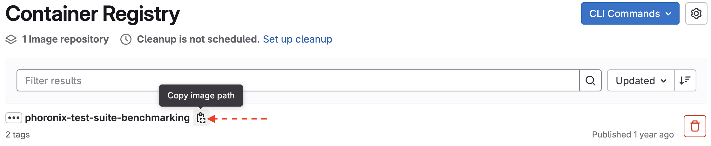

# System Performance Testing with Phoronix Test Suite Benchmarks

The [Phoronix Test Suite](https://openbenchmarking.org/tests) is an open-source benchmarking and comprehensive performance testing tool designed to assess and analyze the performance of hardware systems. It offers a wide range of benchmarks that cover various aspects of system performance, including CPU, GPU, memory, storage, network, file system and many more.  It provides benchmark-specific results such as simulation speed (e.g., ns/day), execution time, or throughput, depending on the test.


Although the Phoronix Test Suite is available as a module on Cheaha, many individual benchmarks require additional dependency installations. To improve the reusability of CPU and GPU benchmarking by the UAB Research Computing (RC) team, the suite has been containerized with all necessary benchmarks and dependencies included. This approach streamlines the testing process, enabling more efficient and automated performance evaluation of the Cheaha system. The containerized Phoronix Test Suite with GROMACS installation is now available for testing in the [Gitlab registry](https://gitlab.rc.uab.edu/rc-data-science/community-containers/phoronix-test-suite-benchmarking/container_registry) for testing. You can access the Phoronix Test Suite repository [here](https://gitlab.rc.uab.edu/rc-data-science/community-containers/phoronix-test-suite-benchmarking).

## GROMACS

[GROMACS](https://openbenchmarking.org/test/pts/gromacs) is a software package commonly used to evaluate the performance of High Performance Computing (HPC) systems. The GROMACS benchmark is available through the [OpenBenchmarking](https://openbenchmarking.org/) repository and can be accessed using the Phoronix Test Suite. The following steps demonstrate how to test a CPU node using Phoronix and GROMACS.

### Container Setup

To begin, pull the Phoronix Test Suite using Singularity by copying the correct image path from this [container registry](https://gitlab.rc.uab.edu/rc-data-science/community-containers/phoronix-test-suite-benchmarking/container_registry). 
  

    
For this example, you can name the image file as `phoronix-latest.sif`.

```bash
$singularity pull phoronix-latest.sif \
docker://gitlab.rc.uab.edu:4567/rc-data-science/community-containers/phoronix-test-suite-benchmarking:latest
```

After pulling the container image, you can run the Phoronix Test Suite using the Singularity image, `phoronix-latest.sif` . First, you will need to run the `batch-setup` option to configure automated test runs non-interactively.

```bash
$singularity run phoronix-latest.sif phoronix-test-suite batch-setup
```
This command launches the test suite inside the container and initiates the batch configuration process, allowing you to specify test preferences, logging, and result handling before execution.

You can follow the prompts to complete the setup:
    
  (i) For saving test results in batch mode, enter n (no)

  ```bash
  Save test results when in batch mode (Y/n): n
  ```
    
  (ii) To avoid running all test options, enter n (no). This is recommended because the gromacs-1.9.0 benchmark includes both CPU and GPU tests. To ensure you are testing the correct environment, manually select the specific option (CPU or GPU) you want to run.

  ```bash
  Run all test options (Y/n): n
  Batch settings saved.
  ```
<!-- markdownlint-disable MD046 -->
!!! important
    You can choose to save the test results in batch mode (Y) if you wish to retain them for future analysis. Additionally, when you run the benchmark later, you will be prompted to name the test result file. This name will be used to store the results and logs for that run.
<!-- markdownlint-enable MD046 -->

## CPU Performance Testing

First, to perform CPU system testing, you will have to request for an exclusive compute node using `srun`.

```bash
$srun --nodes=1 --ntasks-per-node=24 --mem=80GB \
--time=10:00:00 --partition=intel-dcb --pty /bin/bash
```

Next, let us run the benchmark using the `batch-benchmark` option with GROMACS version 1.9.0 via Singularity:
  
```bash
$singularity run phoronix-latest.sif phoronix-test-suite batch-benchmark gromacs-1.9.0
```

This command downloads the GROMACS 1.9.0 test suite along with the necessary sample input files, installs GROMACS 2024 inside the container, and runs the benchmark using available CPU resources. The test uses an MPI (Message Passing Interface) parallel implementation, leveraging multiple CPU processors simultaneously.
  
<!-- markdownlint-disable MD046 -->
!!! note
    (i) Testing requires access to the entire node to ensure accurate performance measurement. This is also necessary because the benchmark utilizes all physical cores in the node, and partial allocations may lead to slot contention or failures due to insufficient available resources — a known issue reported [here](#cpu-testing-known-issues).
    
    (ii)When running on CPU-only nodes, the testing options will not be prompted. By default, the benchmark will automatically perform CPU-based testing in this case.
<!-- markdownlint-enable MD046 -->

```bash
==========
== CUDA ==
==========
CUDA Version 12.2.2

Container image Copyright (c) 2016-2023, NVIDIA CORPORATION & AFFILIATES. All rights reserved.

This container image and its contents are governed by the NVIDIA Deep Learning Container License.
By pulling and using the container, you accept the terms and conditions of this license:
https://developer.nvidia.com/ngc/nvidia-deep-learning-container-license
A copy of this license is made available in this container at /NGC-DL-CONTAINER-LICENSE for your convenience.

WARNING: The NVIDIA Driver was not detected.  GPU functionality will not be available.
   Use the NVIDIA Container Toolkit to start this container with GPU support; see
   https://docs.nvidia.com/datacenter/cloud-native/ .

    Evaluating External Test Dependencies ..............................................................................................................................................................

Phoronix Test Suite v10.8.4
    Installed:     pts/gromacs-1.9.0

System Information

  PROCESSOR:            2 x Intel Xeon Gold 6126 @ 3.70GHz
  Core Count:           24                                                  
  Extensions:           SSE 4.2 + AVX512CD + AVX2 + AVX + RDRAND + FSGSBASE 
  Cache Size:           38.5 MB                                             
  Microcode:            0x2007006                                           
  Core Family:          Cascade Lake                                        
  Scaling Driver:       intel_pstate performance                            
  GRAPHICS:             mgadrmfb
  Screen:               1024x768         
  MOTHERBOARD:          Dell 0H28RR
  BIOS Version:         2.23.0           
  MEMORY:               768GB
  DISK:                 1000GB PERC H740P Mini
  File-System:          gpfs             
  Disk Scheduler:       DEADLINE         
  OPERATING SYSTEM:     Ubuntu 20.04
  Kernel:               3.10.0-1160.24.1.el7.x86_64 (x86_64) 
  Compiler:             GCC 11.4.0 + CUDA 12.2               
  System Layer:         docker                               

GROMACS 2024:

    pts/gromacs-1.9.0 [Implementation: MPI CPU - Input: water_GMX50_bare]
    Test 1 of 1
    Estimated Trial Run Count:    3                     
    Estimated Time To Completion: 6 Minutes [10:42 CDT] 
        Started Run 1 @ 10:37:24
        Started Run 2 @ 10:39:06
        Started Run 3 @ 10:40:54
    Implementation: MPI CPU - Input: water_GMX50_bare:
        2.375
        2.348
        2.351
    Average: 2.358 Ns Per Day
    Deviation: 0.63%
```

The benchmark was run on a system (intel-dcb partition) with 2 Intel Xeon Gold 6126 processors running at 3.70 GHz, totaling 24 CPU cores. The test utilized an MPI CPU implementation of GROMACS 2024 with the water_GMX50_bare as input, a water molecular system. The performance of the GROMACS simulation is measured in nanoseconds per day (Ns/day)—a metric that indicates how many nanoseconds of simulation time can be computed in one day of real-world time. Across three trial runs, the simulation achieved an average performance of 2.358 nanoseconds per day with very low variation (0.63% deviation), demonstrating consistent and efficient use of the available CPU cores. The following section provides a detailed breakdown of the metrics and results.

### Results of CPU-Based Performance Testing

The GROMACS performance test was executed using MPI on a multi-core CPU setup, running three benchmark trials to ensure consistency. Benchmarks were evaluated using the following key performance metrics:

{{ read_csv('cheaha/res/cpu_perf_test.csv', keep_default_na=False) }}

These metrics provide a reliable foundation for comparing node types, diagnosing bottlenecks, and assessing the scalability of the simulation environment. They are especially useful when evaluating different hardware configurations or GROMACS versions.

A crucial performance indicator is the Simulation Speed (ns/day), which reflects how fast the simulation progresses. For instance, a speed of 2.3 ns/day means the system can simulate 2.3 nanoseconds of molecular behavior in one real-world day. Therefore, higher values indicate faster simulation and better overall performance.

The results demonstrate highly efficient parallel performance, minimal load imbalance, and stable simulation speed all of which are strong indicators of an optimized CPU-based GROMACS environment. This confirms the environment is well-optimized for CPU-bound molecular dynamics simulations using GROMACS.

### CPU Testing: Known Issues

(i) Slot Allocation Failure in GROMACS Benchmark

During CPU performance testing, the GROMACS benchmark fails with a `non-zero exit status` as shown below. This is because the benchmarking requests more CPU slots than were allocated. By default, it requires all physical cores of an entire node i.e., 128 MPI ranks in this case, but only 24 cores were requested on the `amd-hdr100` partition, causing the failure.

To resolve this, the recommended solution is to run the benchmark on a full node with 128 cores, matching the default MPI rank count. Alternatively, to run the benchmark on a smaller allocation or customize performance testing, the test profile can be modified to reduce the number of MPI ranks accordingly.


```bash
GROMACS 2024:
    pts/gromacs-1.9.0 [Implementation: MPI CPU - Input: water_GMX50_bare]
    Test 1 of 1
    Estimated Trial Run Count:    3                     
    Estimated Time To Completion: 5 Minutes [11:34 CDT] 
        Started Run 1 @ 11:30:08
        The test quit with a non-zero exit status.
        Started Run 2 @ 11:30:14
        The test quit with a non-zero exit status.
        Started Run 3 @ 11:30:18
        The test quit with a non-zero exit status.
        E: There are not enough slots available in the system to satisfy the 128
```

## GPU Performance Testing

To perform GPU system testing you will have to request for a compute node requesting 2 GPUs. 
```bash
$ srun --ntasks=12 --gres=gpu:2 --mem=100GB--time=10:00:00 \
--partition=amperenodes --pty /bin/bash
```

<!-- markdownlint-disable MD046 -->
!!! important
    (i) GPU testing has been successful on A100 nodes, ie., the `amperenodes` and `amperenodes-medium` partitions. For more details, see the known issue reported [here](#gpu-testing-known-issues). Until compatibility on Pascal nodes is confirmed, you can run GPU tests on `amperenodes` partitions.
    (ii) Multi-GPU (>1GPU) runs currently fail due to PME (Particle Mesh Ewald) tuning conflicts at the reset step. As a workaround, run simulations on a single GPU for now. Refer to this [issue](#gpu-testing-known-issues) for more details.

<!-- markdownlint-enable MD046 -->

After acquiring the necessary GPU resources and completing the [batch setup](#container-setup) process, set the CUDA_VISIBLE_DEVICES environment variable and run the GROMACS benchmark  using Singularity with GPU support enabled via the `--nv` flag. The `--nv` flag ensures that NVIDIA GPU libraries and drivers from the host are available inside the container at runtime.

```bash
$ export CUDA_VISIBLE_DEVICES=0
$ singularity run --nv phoronix-gromacs.sif phoronix-test-suite batch-benchmark gromacs-1.9.0
```

The following showcase the results obtained from running the GROMACS 2024 GPU benchmark on an A100 node with CUDA 12.2.2. The system featured dual AMD EPYC 7763 processors with 128 cores. Across three trial runs, the benchmark achieved an average of 23.556 nanoseconds per day with minimal deviation (0.03%), indicating highly consistent and stable runs across trials. The high simulation speed shows that the A100 GPU was effectively used for computation, while the CPU efficiently handled data management and non-GPU tasks. Overall, the results demonstrate a well-balanced CPU-GPU configuration optimized for high-performance molecular dynamics workloads.

```bash
==========
== CUDA ==
==========

CUDA Version 12.2.2

Container image Copyright (c) 2016-2023, NVIDIA CORPORATION & AFFILIATES. All rights reserved.

This container image and its contents are governed by the NVIDIA Deep Learning Container License.
By pulling and using the container, you accept the terms and conditions of this license:
https://developer.nvidia.com/ngc/nvidia-deep-learning-container-license

A copy of this license is made available in this container at /NGC-DL-CONTAINER-LICENSE for your convenience.

    Evaluating External Test Dependencies ..................................

Phoronix Test Suite v10.8.4
    Installed:     pts/gromacs-1.9.0

GROMACS 2024:
    pts/gromacs-1.9.0
    System Test Configuration
        1: MPI CPU
        2: NVIDIA CUDA GPU
        3: Test All Options
        ** Multiple items can be selected, delimit by a comma. **
        Implementation: 2

System Information
  PROCESSOR:              2 x AMD EPYC 7763 64-Core
    Core Count:           128                                      
    Extensions:           SSE 4.2 + AVX2 + AVX + RDRAND + FSGSBASE 
    Cache Size:           512 MB                                   
    Microcode:            0xa0011d3                                
    Core Family:          Zen 3                                    

  GRAPHICS:               NVIDIA A100 80GB PCIe
    BAR1 / Visible vRAM:  131072 MiB       
    Display Driver:       NVIDIA           
    Screen:               1024x768         

  MOTHERBOARD:            Dell 03WYW4
    BIOS Version:         2.14.1           

  MEMORY:                 512GB

  DISK:                   2 x 3201GB Dell Ent NVMe CM6 MU 3.2TB + 2 x 480GB SK hynix HFS480G32FEH-BA1
    File-System:          gpfs             
    Disk Scheduler:       NONE             

  OPERATING SYSTEM:       Ubuntu 20.04
    Kernel:               3.10.0-1160.24.1.el7.x86_64 (x86_64) 
    Desktop:              Xfce                                 
    Compiler:             GCC 11.4.0 + CUDA 12.2               
    System Layer:         docker                               

GROMACS 2024:
    pts/gromacs-1.9.0 [Implementation: NVIDIA CUDA GPU - Input: water_GMX50_bare]
    Test 1 of 1
    Estimated Trial Run Count:    3                     
    Estimated Time To Completion: 4 Minutes [14:57 CDT] 
        Started Run 1 @ 14:54:12
        Started Run 2 @ 14:54:57
        Started Run 3 @ 14:55:42

    Implementation: NVIDIA CUDA GPU - Input: water_GMX50_bare:
        23.556
        23.563
        23.549

    Average: 23.556 Ns Per Day
    Deviation: 0.03%
```

GPU usage and activity can be monitored with `nvidia-smi`, which shows real-time GPU memory use, utilization %, and running processes. If you see GPU utilization increasing during a GROMACS run, it means the GPU is actively working. The below `nvidia-smi` output indicates that the system has two NVIDIA A100 80GB GPUs. GPU 0 is actively running a GROMACS process (gmx), using approximately 1074 MiB of GPU memory and 94% GPU utilization.

```bash
$ nvidia-smi
+-----------------------------------------------------------------------------------------+
| NVIDIA-SMI 550.90.07              Driver Version: 550.90.07      CUDA Version: 12.4     |
|-----------------------------------------+------------------------+----------------------+
| GPU  Name                 Persistence-M | Bus-Id          Disp.A | Volatile Uncorr. ECC |
| Fan  Temp   Perf          Pwr:Usage/Cap |           Memory-Usage | GPU-Util  Compute M. |
|                                         |                        |               MIG M. |
|=========================================+========================+======================|
|   0  NVIDIA A100 80GB PCIe          On  |   00000000:25:00.0 Off |                    0 |
| N/A   39C    P0             64W /  300W |    1083MiB /  81920MiB |     94%      Default |
|                                         |                        |             Disabled |
+-----------------------------------------+------------------------+----------------------+
|   1  NVIDIA A100 80GB PCIe          On  |   00000000:81:00.0 Off |                    0 |
| N/A   31C    P0             43W /  300W |       1MiB /  81920MiB |      0%      Default |
|                                         |                        |             Disabled |
+-----------------------------------------+------------------------+----------------------+
                                                                                         
+-----------------------------------------------------------------------------------------+
| Processes:                                                                              |
|  GPU   GI   CI        PID   Type   Process name                              GPU Memory |
|        ID   ID                                                               Usage      |
|=========================================================================================|
|    0   N/A  N/A     82610      C   ...s/gromacs-1.9.0//cuda-build/bin/gmx       1074MiB |
+-----------------------------------------------------------------------------------------+
```

### Results of GPU-Based Performance Testing

GPU-based GROMACS testing on A100 nodes showed consistently high simulation performance, achieving ~23.55 ns/day. The high parallel efficiency (~1199%) reflects the total core time accumulated across 12 CPU cores, compared to the actual elapsed wall time (~14.67 seconds). This indicates strong CPU utilization alongside efficient GPU acceleration. This setup offers a well-balanced configuration for fast, large-scale molecular dynamics simulations.

{{ read_csv('cheaha/res/gpu_perf_test.csv', keep_default_na=False) }}


### GPU Testing: Known Issues

(i) GROMACS GPU Benchmark Failure on Pascal Nodes

When running the GROMACS 2024 GPU benchmark via the Phoronix Test Suite on Pascal-based GPU nodes (pascalnodes and pascalnodes-medium), the following error was encountered:

```bash 
[pts/gromacs-1.9.0 Implementation: NVIDIA CUDA GPU - Input: water_GMX50_bare] NVIDIA CUDA support is not available.
```

This indicates that the test could not detect or initialize CUDA GPU support.  The likely reason for this failure is that GROMACS 2024 was compiled with CUDA 12.2.2, which requires a GPU with Compute Capability > 6.1.

Pascal nodes have Compute Capability 6.0, which is no longer supported by CUDA 12.2 and newer. As a result, CUDA support is unavailable when running on Pascal-based GPUs. Refer to the official [CUDA support matrix](https://docs.nvidia.com/deeplearning/cudnn/backend/latest/reference/support-matrix.html) for more details.
To address this issue for now, please run GPU testing on one of the `amperenode` partitions until we develop and test a separate container using CUDA 12.0 or lesser to enable compatibility with Pascal nodes.


(ii) Running GROMACS on Multiple GPUs Failure

When running GROMACS on multiple GPUs (2 GPUs), the program needs some time to adjust and optimize certain calculations i.e., PME (Particle Mesh Ewald) tuning. This tuning requires careful synchronization across all GPUs. The following error message means the program tried to restart its internal tracking too soon—before this tuning was finished—which caused it to crash.

```bash
Fatal error:
PME tuning was still active when attempting to reset mdrun counters at step
2000. Try resetting counters later in the run, e.g. with gmx mdrun -resetstep.
```

To fix the issue, for now, it is recommended to run the simulation on a single GPU to monitor GPU system performance without causing the PME tuning error. If multi-GPU testing is essential, you may experiment with the `-resetstep` option in gmx mdrun to manually set the counter to a particular step and reset point after PME tuning completes. Further investigation and testing are needed to determine a stable multi-GPU configuration.
