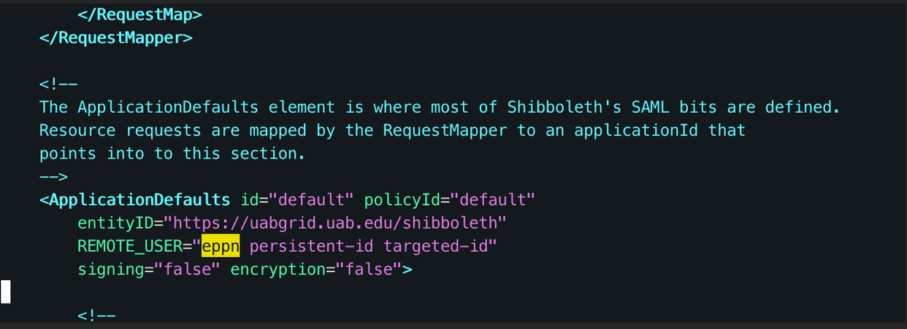

# Zero Trust Proxy Configurtion

To get an overview of what we will be working with later we start in `/etc/shibboleth/shibboleth2.xml` (no changes needed here)

- Here in the `ApplicationDefaults` section we have configured the policy that determines what our `REMOTE_USER` value will be as it flows through the proxy. The current set up is to check for eppn, then persistent-id, then finally targeted-id and then assign it to `REMOTE_USER`.



Next we will look at `/etc/shibboleth/attribute-map.xml`

- In this file we can configure how the eppn value is decoded. In the current configuration we have left it as scoped but its possible to transform it into a simple string value as well


Here in `/etc/shibboleth/attribute-policy.xml` there are a few more change points

- First is the highlighted section showing the eppn. We currently have the `PermitValueRule` set to `basic:ANY` to allow the value to flow through simply as it is. Previously we were using the `PermitValueRuleReference ScopingRules` which can be seen towards the top of the screenshot, this policy defines what an acceptable value is for the rules that reference it.

```diff
 <afp:AttributeRule attributeID="eppn">
+    <afp:PermitValueRule xsi:type="basic:ANY" />
-    <afp:PermitValueRuleReference ref="ScopingRules" />
 </afp:AtttributeRule>

```

In `/etc/httpd/conf.d/front-end.conf` we have a completely new entry

- From the top we set a wide-open location match that will allow the application behind the proxy to be able to easily check back in with the proxy for each request (applying a zero trust-esque flow). In the auth section below we set up this location to require shibboleth and currently let the application handle what to do with an unauthorized user.

- In the next block we preform one of two different regex matches depending on if a user has a BlazerID or if they are a XIAS user. Then we update REMOTE_USER and send it back down to the application

```diff
+   <LocationMatch "/.*">
+       AuthType shibboleth
+       ShibRequestSetting requireSession false
+       Require shibboleth
+       ShibUseHeaders On
+       #these lines match know EPPNs
+       #Matches a standard BlazerId
+       RewriteCond %{LA-U:REMOTE_USER} ^([a-zA-Z1-0_.+-]+@uab.edu)$ [OR]
+       #Matches a xias account with the @uab domain at the end
+       RewriteCond %{LA-U:REMOTE_USER} ^(.*@[^@]*?)@uab.edu$
+       RewriteRule . - [E=REMOTE_USER%1]
+       #this section applies the changes we have made above to the REMOTE_USER value that we send downstream
+       RequestHeader set REMOTE_USER "expr=%{ENV:REMOTE_USER}"
+       RequestHeader set X-Forwarded-Scheme http
+
+       #these are placeholder values, for an actual application we would simply insert the ip/dns entry for the application itself
+       ProxyPass http://login001/
+       ProxyPassReverse http://login001/
+   </LocationMatch>
 </VirtualHost>
```
