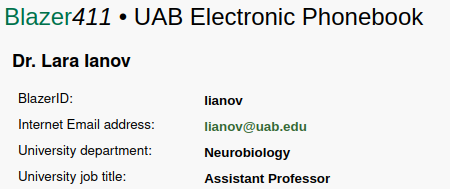

# Common Tickets

<!-- markdownlint-disable MD033 MD034 -->

## Account Registration

### General Cheaha Account Request

All UAB users can request their own Cheaha account by going to [https://rc.uab.edu](https://rc.uab.edu) and filling out a short form. No intervention on our end is required.

**Canned Response**:

>Hi,
>
>All UAB students, faculty, and staff can create their own Cheaha account by going to https://rc.uab.edu and filling out a short form. Once the form is complete, your account will be immediately ready for use. All accounts have 5 TB of personal space on the cluster. Please read through our Cheaha documentation at https://docs.rc.uab.edu/cheaha/getting_started/ to familiarize yourself with how the cluster operates. If you are able to create your account or run into any errors, please let us know in this ticket. Thank you

### Cloud Account Request

Cloud accounts must be created by Clyde or John as of now and is not linked with SSO. Go through the following steps:

1. Create a [task](#creating-a-servicenow-task) on the ticket giving the BlazerID or XIAS name for the person requesting the account. Commonly looks like `Create Cloud account for <blazerid_or_XIAS>`. Omit any `@uab.edu` string for BlazerIDs, but keep the email host for XIAS accounts.
2. Copy the task link from the main ticket page (looks like `TASK0000000`) and put in the Slack tickets channel something like `@rc-ops-grp <task_id> Request to create cloud account for <blazerid_or_XIAS>`. Make sure the task is an actual link to the task to make it easier on Ops.

**Canned Response**:

>Hi,
>
>I've passed this request along to our Ops team who should be able to create your account shortly. You will receive an email with instructions on how to activate the account and set your password once it's created. Cloud.RC is not currently connected to UAB's single sign-on so you can choose the same or different password from your BlazerID or XIAS account. Please go to our documentation at https://docs.rc.uab.edu/uab_cloud/ to familiarize yourself with Cloud. There is a tutorial on required setup steps before you're able to create any virtual machines. If you run into any issues, feel free to let us know in a new ticket. Thank you

### LTS Account Request

Cloud accounts must be created by Clyde or John as of now and is not linked with SSO. Go through the following steps:

1. Create a [task](#creating-a-servicenow-task) on the ticket giving the BlazerID or XIAS name for the person requesting the account. Commonly looks like `Create Cloud account for <blazerid_or_XIAS@host.edu>`. All personal accounts should include the email host (`@uab.edu` or otherwise)
2. Copy the task link from the main ticket page (looks like `TASK0000000`) and put in the Slack tickets channel something like `@rc-ops-grp <task_id> Request to create cloud account for <blazerid_or_XIAS@host.edu>`. Make sure the task is an actual link to the task to make it easier on Ops.

**Canned Response**:

>Hi,
>
>I've passed this request along to our Ops team who should be able to create your account shortly. You will receive an email with a set of access keys and instructions on how to use the account. Please visit our documentation at https://docs.rc.uab.edu/data_management/lts/ to familiarize yourself with LTS. If you run into any issues, feel free to let us know in a new ticket. Thank you

## Shared Space Requests

### Cheaha Project Space

**Example Ticket**: [RITM0694996](https://uabprod.service-now.com/nav_to.do?uri=%2Fsc_req_item.do%3Fsys_id%3Dafe0e0a81bdd0a908a7821f2b24bcbf4%26sysparm_record_target%3Dsc_req_item%26sysparm_record_row%3D50%26sysparm_record_rows%3D5439%26sysparm_record_list%3Dassignment_groupDYNAMICd6435e965f510100a9ad2572f2b47744%5Eassignment_group!%3D4a687cd637f072c0cda353b543990ea8%5EORassignment_group%3D%5EORassignment_group%3D4a687cd637f072c0cda353b543990ea8%5Eopened_by%3De6c34574377371007114a6d2b3990e3a%5Ecat_itemNOT%2BIN579212a93705a70024a67c1643990e84,61c24473db5650104ff1fd7aae961961,998fc4ec1b3aa5106bd68552604bcb3c%5EORcat_item%3D%5EORcat_itemIN579212a93705a70024a67c1643990e84,61c24473db5650104ff1fd7aae961961,998fc4ec1b3aa5106bd68552604bcb3c%5Eopened_by%3De6c34574377371007114a6d2b3990e3a%5EORDERBYDESCsys_updated_on)

In order to request a project space on Cheaha, the person must be a PI (have title of Assistant, Associate, or Full Professor) or core director (almost always Professor title but could vary). PIs can only own one project space unless they are also a core director. In that case, they can own the core space as well as one lab space.

1. Check their job title at the following places:

    1. The Outlook People menu. Search for the person's name or email in the search bar and it should pull up some information on them. This is useful since it works for both UAB and UABMC email addresses.

    2. The [UAB Directory](https://www.uab.edu/directory/). You'll need to authenticate to search for people, but you can enter either their name or their BlazerID. Their position should be listed in the results. See below for an example

        

    3. Search their name plus UAB in Google. Do some sleuthing around the UAB site.

2. Check if they already own a project space.

    1. You will need their BlazerID for this which is on the ticket if the original email came from their UAB email address. If it came from a UABMC or other address, you can use the UAB directory and search for them there.

    2. Open a terminal on Cheaha and run the following: `ll /data/project | grep <blazerid>`. If nothing shows up, they do not own a project space yet. If an entry does appear, check if it's a core account by searching the name of the project space. These projects are generally named exactly the same as the name of the core. If you're unsure about something, get assistance from William, Matt, or Prema or get clarification about the existing project space on the ticket.

3. If they meet the criteria for the project space, ask them what they would like the name of the project space to be as well as a list of BlazerIDs to have access to the space. Suggest project names such as the following:

    1. Their last name + 'lab', e.g. `warrinerlab`. Make sure that project name does not already exist

    2. Their BlazerID + 'lab'.

    If they already have another name they would like, that's fine. Suggest they keep names as brief as possible to help others remember and type the name.

**Space Granted Canned Response**:

>Hi,
>
>We can get that project space created for you. Please give us a list of BlazerIDs for the people who should have access to the space as well as the name of the space. In general, we suggest names such as [[insert suggested names]], but we can use any name you prefer. Once we get that information, we can get everything set up for you.

**Space Rejected Canned Response (already have a project space)**:

>Hi,
>
>I'm sorry, but due to storage constraints on Cheaha, we limit the number of project spaces to 1 per PI. If you need additional storage, we have our long-term storage platform available. If you don't have an account there, we can create a lab account with access to 75 TB of space. Let me know if that sounds good to you. Sorry again.

## Software Installation

In general, we do not want to install software as modules if we do not need to. Having something available as a module means we need to maintain and update it which is time-consuming. Most software researchers want to use is available via Anaconda/Pip and Docker, both of which are installable by the researcher. When dealing with these requests, we need to find the package first and test the installation process to make it seamless for the researcher. I generally check package availability in the following order:

1. Check conda for software package, google `conda <software_name>`
2. Check dockerhub for software, google `dockerhub <software_name>`. Can be used with singularity on the cluster
3. Check the current available modules to see if they missed it. Use `module spider` with part of the software name and see what appears.
4. Check the github repo or software website for installation instructions.

You will want to check on package versions as well as when the packages were last updated at each site to see if one source has a more recently updated version. If a specific older version is requested, you can test with that specific version as well as offer the option for the newer version depending on what they want.

### Conda/Pip Installation

**Example Ticket**: [RITM0667998](https://uabprod.service-now.com/nav_to.do?uri=%2Fsc_req_item.do%3Fsys_id%3Df448fd171b52fd902e00eb93604bcb2a%26sysparm_record_target%3Dsc_req_item%26sysparm_record_row%3D12%26sysparm_record_rows%3D249%26sysparm_record_list%3Dassignment_groupDYNAMICd6435e965f510100a9ad2572f2b47744%5Eshort_descriptionCONTAINSinstall%5Eassignment_group!%3D4a687cd637f072c0cda353b543990ea8%5EORassignment_group%3D%5EORassignment_group%3D4a687cd637f072c0cda353b543990ea8%5Eopened_by%3De6c34574377371007114a6d2b3990e3a%5Ecat_itemNOT%2BIN579212a93705a70024a67c1643990e84,61c24473db5650104ff1fd7aae961961,998fc4ec1b3aa5106bd68552604bcb3c%5EORcat_item%3D%5EORcat_itemIN579212a93705a70024a67c1643990e84,61c24473db5650104ff1fd7aae961961,998fc4ec1b3aa5106bd68552604bcb3c%5Eopened_by%3De6c34574377371007114a6d2b3990e3a%5EORDERBYDESCsys_created_on)

Try installing the requested package into a clean environment using the exact instructions on the package's anaconda.org page. If you need to use `pip` to install a package, make sure you install `pip` into the conda environment first to prevent the package from being saved in the `${HOME}/.local` folder. Installing pip will also install the newest version of Python by default. You will need to check on the package's PyPi page which versions of Python the package is compatible with. You can find this information at the bottom of the page in the Classifiers -> Programming Language section.

A simple example installing `samtools` from conda is shown below.

```bash
module load Anaconda3
conda create -n sam
conda activate sam
conda install bioconda::samtools
```

After installing the package, you can try to print the help message for the main function in the package (the `samtools` function in this example) to make sure the binary at least does that. The package's Github page should also ahve some general instructions on how to use the package along with some listed commands. You can also look in `${HOME}/.conda/envs/<environment>/bin` to see if one of the commands there looks important and try to print the help for it.

It's not important to make sure the full package runs perfectly. We almost never have the expertise nor the data necessary to test these pipelines fully. Making sure it prints a help message is the most we need to do. If the users have issues running it, they will let us know.

**Canned Response**:

>Hi,
>
>This package is available via Anaconda. You can install it using the following commands:
>
> \------------------------------------------------------------------
>
> module load Anaconda3<br>
> <insert full list of installation commands here\>
>
> \------------------------------------------------------------------
>
>Once the installation finishes, you'll be able to use the package using the following command: <insert tested help message command>. To use this package in other jobs, you do not need to install it again, you just need to load Anaconda3 and activate the environment created above. You can read more about Anaconda in our docs at https://docs.rc.uab.edu/workflow_solutions/using_anaconda/. Let us know if you run into any issues.

### Singularity

**Example Ticket:** [RITM0691497](https://uabprod.service-now.com/nav_to.do?uri=%2Fsc_req_item.do%3Fsys_id%3Ddd5f58861bbc02108a7821f2b24bcbcd%26sysparm_record_target%3Dsc_req_item%26sysparm_record_row%3D1%26sysparm_record_rows%3D141%26sysparm_record_list%3Dassignment_groupDYNAMICd6435e965f510100a9ad2572f2b47744%5Eshort_descriptionCONTAINSmodule%5Eassignment_group!%3D4a687cd637f072c0cda353b543990ea8%5EORassignment_group%3D%5EORassignment_group%3D4a687cd637f072c0cda353b543990ea8%5Eopened_by%3De6c34574377371007114a6d2b3990e3a%5Ecat_itemNOT%2BIN579212a93705a70024a67c1643990e84,61c24473db5650104ff1fd7aae961961,998fc4ec1b3aa5106bd68552604bcb3c%5EORcat_item%3D%5EORcat_itemIN579212a93705a70024a67c1643990e84,61c24473db5650104ff1fd7aae961961,998fc4ec1b3aa5106bd68552604bcb3c%5Eopened_by%3De6c34574377371007114a6d2b3990e3a%5EORDERBYDESCsys_created_on)

If a package or software isn't available via conda/pip, search on Dockerhub instead. Most containers from Dockerhub can be easily converted to Singularity containers on Cheaha. The downside is that it requires the user to learn a little bit of singularity, but it can make installation and use easier in the long run.

Search `<software> docker` to find potential matches on dockerhub. There may also be instructions for installing via Docker on the Github page so it helps to check there too. Containers can be created like so:

```bash
module load Singularity
singularity pull fmriprep.sif docker://nipreps/fmriprep
```

If the entrypoint for a container is a command-line tool, you may be able to print the help for that tool with `singularity run`. Using the fmriprep example above, it would be `singularity run fmriprep.sif --help`. If it prints a help message and doesn't error, it should be fine. You can also use `singularity exec` or `singularity shell` commands to test if some parts of the container work correctly. Like with conda, don't worry about making sure a container run an entire pipeline correctly, the user will let us know if it doesn't.

**Canned Response:**

> Hi,
>
> This tool is available through Singularity, a container tool similar to Docker. A container packages up software and all its dependencies into a single file (a.k.a image) that can be run from one computing environment to another. We have documentation on how to use Singularity at https://docs.rc.uab.edu/workflow_solutions/getting_containers/#containers-on-cheaha. You can install the container using the following commands:
>
> \-----------------------------------------------------------------------------
>
> module load Singularity<br>
> <insert singularity pull command\>
>
> \-----------------------------------------------------------------------------
>
> You can run the container using the following command: 'singularity run <container.sif> [add options here]'. If you need help running the container, please come to office hours on Monday or Thursday from 10-12 on Zoom and we would be happy to assist. You can find the Zoom links at https://docs.rc.uab.edu/#how-to-contact-us.

Note that you may need to change the example command based on what works. For example, if a container doesn't have an entrypoint, anything inside it will need to be run with `singularity exec <container.sif> <command> [options]` instead of `singularity run`. Make sure you have a baseline understanding about how to run something from that container before responding.

### Module Installation

**Example ticket:** [RITM0600320](https://uabprod.service-now.com/nav_to.do?uri=%2Fsc_req_item.do%3Fsys_id%3Ddbb469f21b1ca114a8e26571604bcb77%26sysparm_record_target%3Dsc_req_item%26sysparm_record_row%3D12%26sysparm_record_rows%3D78%26sysparm_record_list%3Dassignment_groupDYNAMICd6435e965f510100a9ad2572f2b47744%5Eshort_descriptionCONTAINSupdate%5Eassignment_group!%3D4a687cd637f072c0cda353b543990ea8%5EORassignment_group%3D%5EORassignment_group%3D4a687cd637f072c0cda353b543990ea8%5Eopened_by%3De6c34574377371007114a6d2b3990e3a%5Ecat_itemNOT%2BIN579212a93705a70024a67c1643990e84,61c24473db5650104ff1fd7aae961961,998fc4ec1b3aa5106bd68552604bcb3c%5EORcat_item%3D%5EORcat_itemIN579212a93705a70024a67c1643990e84,61c24473db5650104ff1fd7aae961961,998fc4ec1b3aa5106bd68552604bcb3c%5Eopened_by%3De6c34574377371007114a6d2b3990e3a%5EORDERBYDESCsys_created_on)

In almost every case where a piece of software is not available via conda or singularity, it will need to be installed as a module. In some rare instances, a user could install an `rpm`, `deb`, etc. package into their personal space, but this can be quite complicated. Ask Matt for details if you determine this is a potential solution.

If the software is licensed and has not already been installed, ask the user details about the license. Typical licensed software connects to a license server to distribute floating licenses or requires a license file installed in the module itself. Details on a license may also be included in the installation instructions. Licensed software typically restricts who can use it if the license is owned by a specific person, lab, or department. If that is the case, we need to know who should have access to the module as well.

1. Check if the software exists on [EasyBuild's supported software](https://docs.easybuild.io/version-specific/supported-software/). For example, here is an entry for the [R programming language](https://docs.easybuild.io/version-specific/supported-software/#r_1). It has up to version 4.3.3 available along with many older versions. Paid, licensed software is almost never found here. If it does not exist there, find a descriptive set of installation instructions on the software website or their Github repo.
2. Create an issue on our [cluster software repo](https://gitlab.rc.uab.edu/rc/cluster-software). Title should be something like `Install <software> Version <version_number>`
3. The issue description should contain the ticket number as well as a link to the easybuild site, a link to other installation instructions, or the instructions in an attached file. If the software is licensed, include details about how to set up the license and who should have access to the module.
4. Add the `Backlog` and other relevant labels to the issue. Submit the issue.

**Canned Response Prior to Installation:**

> Hi,
>
> We have passed this request along to our DevOps team. We do not have a definite timetable on when the module will be ready but will keep you updated as things progress. We appreciate your patience.

If your searching doesn't turn up any good installation instructions and those aren't included in the ticket, please ask the user to provide those instructions or point to a site where they can easily be found.

**Canned Response After Installation:**

> Hi,
>
>We have installed this under <insert full module name\>. You can load the module using the following command: 'module load <module\>'. Please test out the software and let us know if you run into any problems with it. Thank you

## Service Outage

**Example Ticket:** [RITM0690729](https://uabprod.service-now.com/nav_to.do?uri=%2Fsc_req_item.do%3Fsys_id%3D7f72dc8197b442d00917316bf253af31%26sysparm_record_target%3Dsc_req_item%26sysparm_record_row%3D28%26sysparm_record_rows%3D2274%26sysparm_record_list%3Dassignment_groupDYNAMICd6435e965f510100a9ad2572f2b47744%5Eshort_descriptionCONTAINScheaha%5Eassignment_group!%3D4a687cd637f072c0cda353b543990ea8%5EORassignment_group%3D%5EORassignment_group%3D4a687cd637f072c0cda353b543990ea8%5Eopened_by%3De6c34574377371007114a6d2b3990e3a%5Ecat_itemNOT%2BIN579212a93705a70024a67c1643990e84,61c24473db5650104ff1fd7aae961961,998fc4ec1b3aa5106bd68552604bcb3c%5EORcat_item%3D%5EORcat_itemIN579212a93705a70024a67c1643990e84,61c24473db5650104ff1fd7aae961961,998fc4ec1b3aa5106bd68552604bcb3c%5Eopened_by%3De6c34574377371007114a6d2b3990e3a%5EORDERBYDESCsys_created_on)

Some outages will occur over time, both planned and unplanned. We notify the community of planned outages beforehand. If you receive a ticket asking about a planned outage, you can respond with the email DevOps sent out if that addresses the question.

For unplanned outages, we generally don't have a great idea when service will be restored in the moment. Keep an eye on the `devops` channel or the channel related to the specific platform on Slack for updates from the Ops team. Otherwise, all tickets should receive a very general acknowledgement that we are aware of the issue and are working to resolve it.

**Canned Response:**

> Hi,
>
> We are aware of the current outage. Our team is working on restoring functionality as soon as possible. [Insert current status and timeframe if available]. We apologize for any inconvenience. Thank you.

### OOD Errors

**Example Ticket:** [RITM0694570](https://uabprod.service-now.com/nav_to.do?uri=%2Fsc_req_item.do%3Fsys_id%3Dd9beea331bcd82908a7821f2b24bcb84%26sysparm_record_target%3Dsc_req_item%26sysparm_record_row%3D1%26sysparm_record_rows%3D1%26sysparm_record_list%3Dassignment_groupDYNAMICd6435e965f510100a9ad2572f2b47744%5EnumberSTARTSWITHRITM0694570%5Eassignment_group!%3D4a687cd637f072c0cda353b543990ea8%5EORassignment_group%3D%5EORassignment_group%3D4a687cd637f072c0cda353b543990ea8%5Eopened_by%3De6c34574377371007114a6d2b3990e3a%5Ecat_itemNOT%2BIN579212a93705a70024a67c1643990e84,61c24473db5650104ff1fd7aae961961,998fc4ec1b3aa5106bd68552604bcb3c%5EORcat_item%3D%5EORcat_itemIN579212a93705a70024a67c1643990e84,61c24473db5650104ff1fd7aae961961,998fc4ec1b3aa5106bd68552604bcb3c%5Eopened_by%3De6c34574377371007114a6d2b3990e3a%5EORDERBYDESCsys_created_on)

Occasionally, there will be an OOD specific error that does not affect the cluster as a whole. This typically comes up as a `500 Internal Server` error. In this case, check if you also receive the error by going to both [https://rc.uab.edu](https://rc.uab.edu) and [https://rc.uab.edu/account](https://rc.uab.edu/account). Sometimes, the account creation service can have an issue while the main OOD will be fine so it's always good to check both.

If you don't see an error on either site yourself, have the user try to access OOD again using a Private Browser. If this still doesn't fix the issue, you can ask for assistance from Ops

If you also see an error, pass the error type along to rc-ops-team on Slack and let them know if it's happening for just the account page or for OOD as a whole.

## Addendums

### Creating a ServiceNow Task

When you need DevOps to complete something in order to address a ticket, create a Task in the ticket and use the Task ID when communicating with DevOps. You can create a task using the following steps:

1. Scroll down to the bottom of the ticket to the `Catalog Tasks` section. There will already be a task for the ticket as a whole. Click `New` to create a new task. This will open a new screen

    

2. Set the Assignment Group to `Research Computing`. Describe the task in the Short Description field. If necessary, add additional information to the Description box.

    

3. Click `Submit` in the top right to finish creation. The new task will appear in the Catalog Tasks section with the original task now.

    
